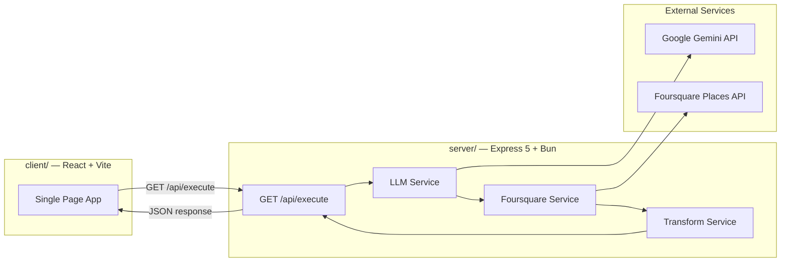
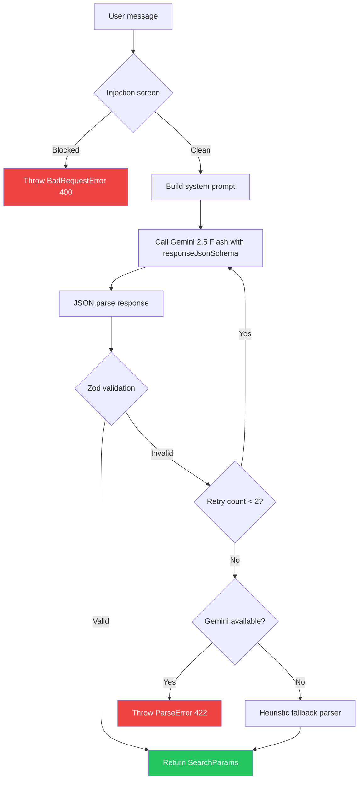
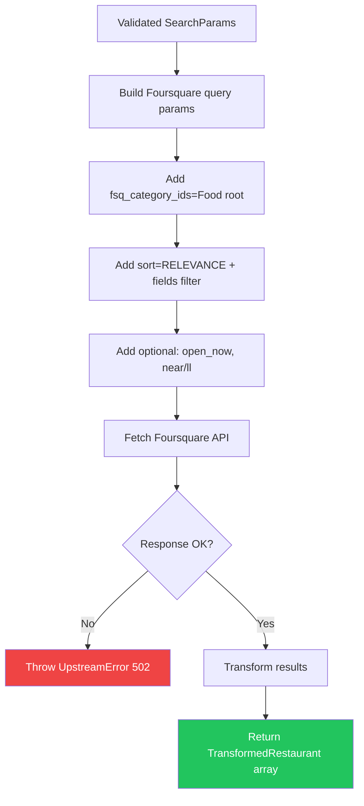

# Technical Blueprint: Restaurant Finder

## High-Level Overview

Restaurant Finder is a pass-through search orchestrator. The backend receives a natural language message, uses Google Gemini to parse it into structured parameters, queries the Foursquare Places API, transforms the results, and returns clean JSON. The frontend renders the results. There is no database.

## Domain Boundaries & Relationships



> [!IMPORTANT]
> No database. No user auth. No session management. This is a stateless, pass-through API.

## Data Models

### Parsed Search Parameters (LLM Output → Zod Validated)

| Field             | Type             | Required | Description                                                                                                    |
| ----------------- | ---------------- | -------- | -------------------------------------------------------------------------------------------------------------- |
| `query`           | `string`         | Yes      | Cuisine or restaurant type (e.g., "sushi", "Italian")                                                          |
| `near`            | `string`         | No       | Location to search (e.g., "downtown Los Angeles"). Defaults to `''` — triggers browser/IP geolocation fallback |
| `min_price`       | `number \| null` | No       | Minimum price level 1-4 (1=cheap, 4=very expensive). For single-price queries, equals `max_price`              |
| `max_price`       | `number \| null` | No       | Maximum price level 1-4. For ranges like "cheap to moderate", differs from `min_price`                         |
| `open_now`        | `boolean`        | No       | Whether to filter for currently open places                                                                    |
| `is_food_related` | `boolean`        | No       | Whether the query is food-related (LLM guardrail)                                                              |

### Transformed Restaurant Response (What we return to the client)

| Field        | Type                               | Description                            |
| ------------ | ---------------------------------- | -------------------------------------- |
| `id`         | `string`                           | Foursquare `fsq_place_id`              |
| `name`       | `string`                           | Restaurant name                        |
| `address`    | `string`                           | Formatted address                      |
| `categories` | `{ name: string; icon: string }[]` | Cuisine/category labels with icon URLs |

| `rating` | `number \| null` | Rating (if available from free tier) |
| `distance` | `number \| null` | Distance in meters from search center |
| `hours` | `{ openNow: boolean; display: string } \| null` | Hours information |
| `location` | `{ lat: number; lng: number } \| null` | Coordinates (for future map view) |

## API Endpoint

### `GET /api/execute`

**Description:** Interprets a natural language restaurant query using an LLM and returns matching restaurants from Foursquare.

#### Query Parameters

| Param     | Type     | Required | Description                                                                                                                   |
| --------- | -------- | -------- | ----------------------------------------------------------------------------------------------------------------------------- |
| `message` | `string` | Yes      | Natural language search query (2-500 chars)                                                                                   |
| `code`    | `string` | Yes      | Must match the configured access code (`ACCESS_CODE` env var)                                                                 |
| `ll`      | `string` | No       | Lat,lng from browser geolocation (e.g., `14.55,121.02`) — used as location fallback when the LLM can't extract a `near` value |

#### Success Response (200)

```json
{
  "status": "success",
  "message": "Restaurants found",
  "data": {
    "results": [
      {
        "id": "4b60ade0f964a52012e529e3",
        "name": "Sushi Gen",
        "address": "422 E 2nd St, Los Angeles, CA 90012",
        "categories": [
          {
            "name": "Sushi Restaurant",
            "icon": "https://ss3.4sqi.net/img/categories_v2/food/sushi_64.png"
          }
        ],

        "rating": null,
        "distance": 450,
        "hours": null,
        "location": { "lat": 34.0483, "lng": -118.239 },
        "link": "/places/4b60ade0f964a52012e529e3"
      }
    ],
    "searchParams": {
      "query": "sushi",
      "near": "downtown Los Angeles, CA",
      "min_price": 1,
      "max_price": 1,
      "open_now": true,
      "is_food_related": true
    },
    "meta": {
      "resultCount": 1,
      "searchedAt": "2026-03-15T18:00:00Z",
      "distanceLabel": "away from downtown Los Angeles, CA",
      "parsedBy": "llm"
    }
  },
  "meta": { "resultCount": 1 }
}
```

> [!NOTE]
> The `searchParams` field is included in the response so the frontend (and evaluators) can see exactly how the LLM interpreted the user's message. This improves transparency and debuggability.

#### Error Responses

| Status | Code                    | When                                   | Response Body             |
| ------ | ----------------------- | -------------------------------------- | ------------------------- |
| `401`  | `UNAUTHORIZED`          | `code` is missing or invalid           | RFC 7807 Problem Document |
| `400`  | `BAD_REQUEST`           | `message` is empty or too long         | RFC 7807 Problem Document |
| `422`  | `PARSE_ERROR`           | LLM could not extract valid parameters | RFC 7807 Problem Document |
| `502`  | `UPSTREAM_ERROR`        | Gemini or Foursquare API fails         | RFC 7807 Problem Document |
| `429`  | `TOO_MANY_REQUESTS`     | Rate limit exceeded                    | RFC 7807 Problem Document |
| `500`  | `INTERNAL_SERVER_ERROR` | Unexpected server error                | RFC 7807 Problem Document |

#### Business Rules & Guardrails

1. Validate `code` against the configured access code FIRST, before any processing
2. Validate `message` is present, non-empty, max 500 chars
3. LLM output is validated with Zod before querying Foursquare
4. If LLM returns invalid values (e.g., `min_price: 5`), retry once with exponential backoff, then fall back to heuristic parser before failing with 422
5. If Foursquare returns 0 results, return empty `results: []` with 200 (not an error)
6. All Foursquare queries include `fsq_category_ids=4d4b7105d754a06374d81259` (root Food category) to prevent grocery stores, hotels, and landmarks from appearing in results
7. Transform Foursquare response to strip noisy/irrelevant fields
8. Non-food queries are rejected early via the `is_food_related` LLM guard before reaching Foursquare

## Core Business Logic

### LLM Parsing Pipeline



**System prompt strategy:**

- Fixed system instruction (never includes user input)
- User message goes in `contents` field only (prevents prompt injection)
- `temperature: 0.1` for deterministic output
- `responseMimeType: 'application/json'` + `responseJsonSchema` forces structured output

### Foursquare Search Pipeline



**Parameter mapping:**

| SearchParams field | Foursquare param                                          |
| ------------------ | --------------------------------------------------------- |
| `query`            | `query`                                                   |
| `near`             | `near` (or `ll` if near is empty)                         |
| `min_price`        | `min_price` (only when not null)                          |
| `max_price`        | `max_price` (only when not null)                          |
| `open_now`         | `open_now`                                                |
| _(always set)_     | `limit=20` (server-controlled via `DEFAULT_RESULT_LIMIT`) |
| _(always set)_     | `sort=RELEVANCE`                                          |
| _(always set)_     | `fsq_category_ids=4d4b7105d754a06374d81259` (Food root)   |

> [!TIP]
> **Client-Side Sorting:** While the backend always requests `sort=RELEVANCE` to get the most semantic matches, the frontend implements dynamic client-side sorting, allowing users to re-order the results by **Distance** without making additional API calls or breaking React Query's structural caching.
> [!IMPORTANT]
> **Foursquare API (2025-06-17 version):**
>
> - Base URL: `https://places-api.foursquare.com/places/search`
> - Auth: `Authorization: Bearer <KEY>` (Bearer prefix required)
> - Required header: `X-Places-Api-Version: 2025-06-17`
> - Category IDs now use hex format (e.g., `4bf58dd8d48988d1d2941735`), not numeric `13065`
> - Response ID field: `fsq_place_id` (not `fsq_id`)
> - Free-tier available fields: `fsq_place_id`, `name`, `location`, `categories`, `distance`, `link`, `latitude`, `longitude`
> - Premium fields (`rating`, `price`, `hours`, `photos`) require paid API credits — return null on free tier
> - `min_price`/`max_price` search params are available on free tier and are passed to Foursquare to filter results by price range

## Validation Schemas (Zod)

| Schema               | Location            | Fields                                                                                                                                                                                                                                                                                                                                                                 |
| -------------------- | ------------------- | ---------------------------------------------------------------------------------------------------------------------------------------------------------------------------------------------------------------------------------------------------------------------------------------------------------------------------------------------------------------------- |
| `executeQuerySchema` | `execute.schema.ts` | `message: z.string().min(2).max(500)`, `code: z.literal(ACCESS_CODE)`, `ll: z.string().max(40).regex(…).optional()`                                                                                                                                                                                                                                                    |
| `searchParamsSchema` | `execute.schema.ts` | `query: z.string()`, `near: z.string().default('')`, `min_price: z.number().min(1).max(4).nullable()`, `max_price: z.number().min(1).max(4).nullable()` + refinement `min_price <= max_price`, `open_now: z.boolean()`, `is_food_related: z.boolean()`. Note: `limit` is server-controlled via `DEFAULT_RESULT_LIMIT` in `llm.constants.ts`, not extracted by the LLM. |
| `envSchema`          | `config/env.ts`     | `PORT`, `NODE_ENV`, `GEMINI_API_KEY`, `FOURSQUARE_API_KEY`, `ALLOWED_ORIGINS`                                                                                                                                                                                                                                                                                          |

## Authentication

The `codeGateMiddleware` validates a static access code from `req.query.code` before any request processing. The code is configured via environment variable and enforced at the route level.

```typescript
// code-gate.middleware.ts
export const codeGateMiddleware = (
  req: Request,
  _res: Response,
  next: NextFunction,
) => {
  const code = req.query.code;
  if (code !== env.ACCESS_CODE) {
    throw new UnauthorizedError('Invalid or missing access code');
  }
  next();
};
```

Applied at route level before the controller:

```typescript
router.get('/execute', codeGateMiddleware, executeController.search);
```

## Error Handling

`AppError` base class → subclass per status → centralized `errorHandler` middleware → RFC 7807 Problem Documents.

**New error subclass for this project:**

```typescript
export class UpstreamError extends AppError {
  constructor(
    message: string = 'External service unavailable',
    meta?: Record<string, unknown>,
  ) {
    super(message, HTTP_STATUS.BAD_GATEWAY, 'UPSTREAM_ERROR', undefined, meta);
  }
}
```

**Existing classes to keep:** `BadRequestError`, `UnauthorizedError`, `RateLimitError`, `ValidationError`.

**Classes to remove:** `NotFoundError`, `ForbiddenError`, `ConflictError` (no DB = no resource conflicts).

## Module File Structure

### Server

```text
server/
├── src/
│   ├── app.ts                              # Express app factory
│   ├── index.ts                            # Server entry point + trust proxy
│   ├── config/
│   │   └── env.ts                          # Zod env validation
│   ├── common/
│   │   ├── constants/
│   │   │   └── app.constants.ts
│   │   ├── middleware/
│   │   │   ├── index.ts                    # Global middleware registration (trust proxy, helmet, CORS, rate limit)
│   │   │   ├── cors.ts                     # CORS config (null-origin blocked in prod)
│   │   │   ├── error-handler.ts            # RFC 7807 error handler
│   │   │   ├── validate-request.ts         # Zod request validation middleware
│   │   │   └── code-gate.middleware.ts     # access code validator
│   │   ├── types/
│   │   │   └── problem-document.ts
│   │   └── utils/
│   │       ├── app-error.ts                # Base error class
│   │       ├── api-errors.ts               # Error subclasses (incl. AmbiguousLocationError)
│   │       └── logger.ts                   # Pino logger
│   ├── modules/
│   │   ├── health/
│   │   │   └── health.route.ts
│   │   └── execute/
│   │       ├── execute.route.ts
│   │       ├── execute.controller.ts
│   │       ├── execute.service.ts          # Main search orchestrator
│   │       ├── execute.schema.ts           # Zod schemas (query + LLM output)
│   │       ├── execute.types.ts
│   │       └── __tests__/
│   │           ├── execute.schema.test.ts
│   │           └── execute.service.test.ts
│   └── services/
│       ├── llm/
│       │   ├── llm.service.ts              # Gemini wrapper (parseMessage)
│       │   ├── llm.constants.ts            # SYSTEM_INSTRUCTION prompt
│       │   ├── llm.guards.ts               # Injection detection + confusables normalization
│       │   └── index.ts
│       └── foursquare/
│           ├── foursquare.service.ts       # Foursquare Places API wrapper
│           ├── foursquare.types.ts
│           └── index.ts
├── .env.example
├── package.json
├── tsconfig.json
└── AGENTS.md
```

### Client

```text
client/
├── src/
│   ├── main.tsx
│   ├── App.tsx                             # Main app (no router)
│   ├── index.css                           # Design tokens + CSS variables
│   ├── api/
│   │   ├── api-client.ts                   # ky instance
│   │   └── search-restaurants.ts           # API call wrapper
│   ├── components/
│   │   ├── search-bar.tsx                  # Search input + geolocation button
│   │   ├── restaurant-card.tsx             # Individual result card
│   │   ├── restaurant-list.tsx             # Results list + sort control
│   │   ├── search-content.tsx              # Layout + results orchestration
│   │   ├── suggestion-chips.tsx            # Dynamic search suggestion pills
│   │   ├── loading-skeleton.tsx            # Skeleton cards while fetching
│   │   ├── error-display.tsx               # Error UI (four-tier: ambiguous, missing, bad request, server)
│   │   └── empty-state.tsx                 # Initial/empty state UI
│   ├── hooks/
│   │   └── use-search-restaurants.ts       # TanStack Query hook
│   ├── types/
│   │   └── restaurant.ts
│   ├── utils/
│   │   ├── api-error.ts                    # ApiError class
│   │   ├── error-guards.ts                 # Type-guard helpers (isAmbiguousLocationError, etc.)
│   │   ├── with-api-error.ts               # HOF wrapper
│   │   ├── sort-results.ts                 # Client-side sort utility
│   │   └── logger.ts
│   └── lib/
│       └── format-price.ts                 # Price label formatter (Budget, Moderate, Budget – Moderate)
├── package.json
├── vite.config.ts
└── tsconfig.json
```

## Deployment Strategy

**Monorepo with subdirectory deployment:**

Both Render and Railway support setting a **Root Directory** per service from a monorepo. You create two services pointing to the same repo:

| Service  | Root Directory | Build Command                | Start Command           |
| -------- | -------------- | ---------------------------- | ----------------------- |
| Backend  | `/server`      | `bun install`                | `bun run start`         |
| Frontend | `/client`      | `pnpm install && pnpm build` | Serve `dist/` as static |

The frontend's `vite.config.ts` will proxy `/api/*` to the backend URL in dev, and in production, the `api-client.ts` will point to the deployed backend URL via an env var (`VITE_API_URL`).

## Verification Plan

### Automated Tests

**Backend tests (Bun test + Supertest):**

1. **Schema validation tests** (`execute.schema.test.ts`):
   - `code` must match the configured access code
   - `message` must be present, 1-500 chars
   - Parsed search params: `min_price`/`max_price` must be 1-4 with `min_price <= max_price`

2. **Service tests** (`execute.service.test.ts`):
   - Mock LLM service → verify Foursquare params are correctly mapped
   - Mock Foursquare response → verify transformation strips noisy fields
   - Test retry logic when LLM returns invalid output
   - Test error propagation (Gemini down, Foursquare down)

3. **Integration test** (with Supertest):
   - `GET /api/execute?code=wrong-code` → 401
   - `GET /api/execute?code=<valid-code>` (no message) → 400
   - `GET /api/execute?code=<valid-code>&message=sushi+in+LA` → 200 (with mocked services)

```bash
# Run all server tests
cd server && bun test
```

### Manual Verification

- Open the frontend in browser → type a search → verify results display
- Test the API endpoint directly in browser/curl
- Test with edge cases: empty message, very long message, nonsense input
