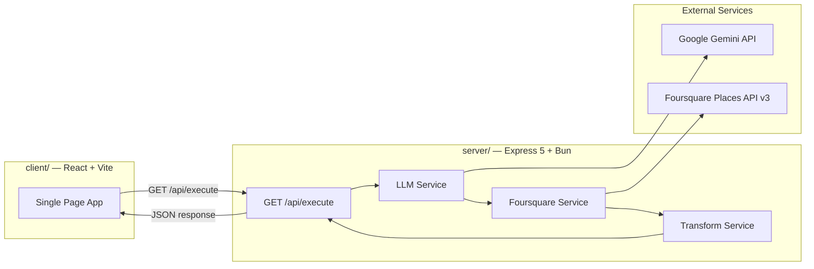
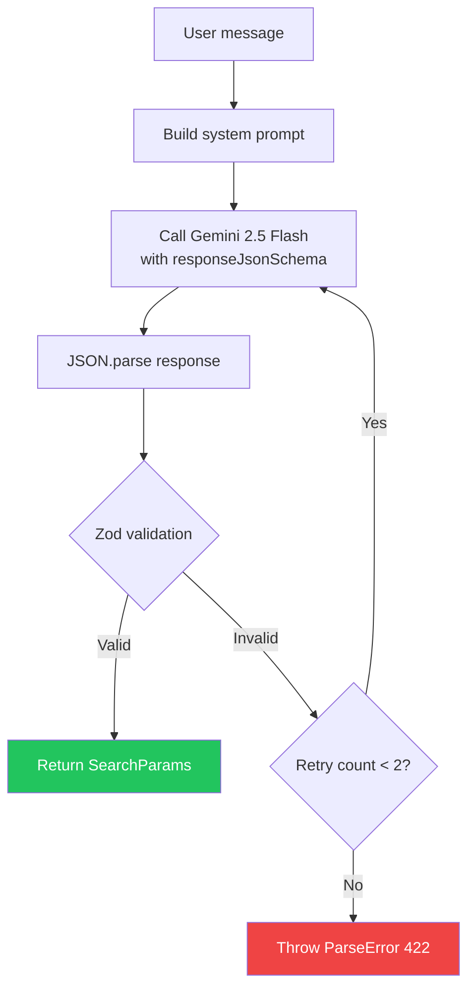
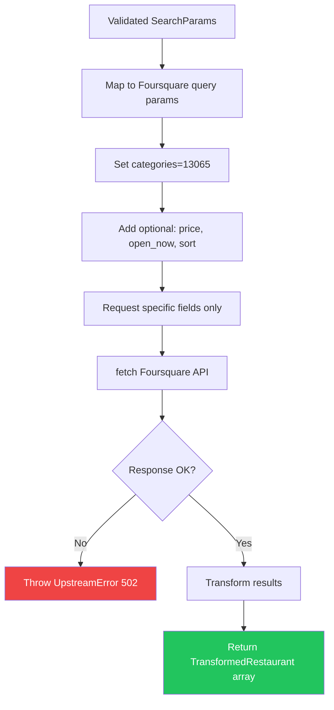

# Technical Blueprint: Restaurant Finder

## High-Level Overview

Restaurant Finder is a pass-through search orchestrator. The backend receives a natural language message, uses Google Gemini to parse it into structured parameters, queries the Foursquare Places API, transforms the results, and returns clean JSON. The frontend renders the results. There is no database.

## Domain Boundaries & Relationships



> [!IMPORTANT]
> No database. No user auth. No session management. This is a stateless, pass-through API.

## Data Models

### Parsed Search Parameters (LLM Output → Zod Validated)

| Field | Type | Required | Description |
|-------|------|----------|-------------|
| `query` | `string` | Yes | Cuisine or restaurant type (e.g., "sushi", "Italian") |
| `near` | `string` | Yes | Location to search (e.g., "downtown Los Angeles") |
| `price` | `number \| null` | No | Price level 1-4 (1=cheap, 4=very expensive) |
| `open_now` | `boolean` | No | Whether to filter for currently open places |
| `limit` | `number` | No | Number of results (default: 10, max: 50) |

### Transformed Restaurant Response (What we return to the client)

| Field | Type | Description |
|-------|------|-------------|
| `id` | `string` | Foursquare `fsq_id` |
| `name` | `string` | Restaurant name |
| `address` | `string` | Formatted address |
| `categories` | `{ name: string; icon: string }[]` | Cuisine/category labels with icon URLs |
| `price` | `number \| null` | Price level 1-4 |
| `rating` | `number \| null` | Rating (if available from free tier) |
| `distance` | `number \| null` | Distance in meters from search center |
| `hours` | `{ openNow: boolean; display: string } \| null` | Hours information |
| `location` | `{ lat: number; lng: number } \| null` | Coordinates (for future map view) |

## API Endpoint

### `GET /api/execute`

**Description:** Interprets a natural language restaurant query using an LLM and returns matching restaurants from Foursquare.

#### Query Parameters

| Param | Type | Required | Description |
|-------|------|----------|-------------|
| `message` | `string` | Yes | Natural language search query (1-500 chars) |
| `code` | `string` | Yes | Must be exactly `pioneerdevai` |

#### Success Response (200)

```json
{
  "results": [
    {
      "id": "4b60ade0f964a52012e529e3",
      "name": "Sushi Gen",
      "address": "422 E 2nd St, Los Angeles, CA 90012",
      "categories": [
        { "name": "Sushi Restaurant", "icon": "https://ss3.4sqi.net/img/categories_v2/food/sushi_64.png" }
      ],
      "price": 2,
      "rating": null,
      "distance": 450,
      "hours": { "openNow": true, "display": "Mon-Sat 11:15 AM-2:00 PM" },
      "location": { "lat": 34.0483, "lng": -118.2390 }
    }
  ],
  "searchParams": {
    "query": "sushi",
    "near": "downtown Los Angeles",
    "price": null,
    "open_now": true,
    "limit": 10
  },
  "meta": {
    "resultCount": 8,
    "searchedAt": "2026-03-12T18:00:00Z"
  }
}
```

> [!NOTE]
> The `searchParams` field is included in the response so the frontend (and evaluators) can see exactly how the LLM interpreted the user's message. This improves transparency and debuggability.

#### Error Responses

| Status | Code | When | Response Body |
|--------|------|------|---------------|
| `401` | `UNAUTHORIZED` | `code` is missing or not `pioneerdevai` | RFC 7807 Problem Document |
| `400` | `BAD_REQUEST` | `message` is empty or too long | RFC 7807 Problem Document |
| `422` | `PARSE_ERROR` | LLM could not extract valid parameters | RFC 7807 Problem Document |
| `502` | `UPSTREAM_ERROR` | Gemini or Foursquare API fails | RFC 7807 Problem Document |
| `429` | `TOO_MANY_REQUESTS` | Rate limit exceeded | RFC 7807 Problem Document |
| `500` | `INTERNAL_SERVER_ERROR` | Unexpected server error | RFC 7807 Problem Document |

#### Business Rules & Guardrails

1. Validate `code === 'pioneerdevai'` FIRST, before any processing
2. Validate `message` is present, non-empty, max 500 chars
3. LLM output is validated with Zod before querying Foursquare
4. If LLM returns invalid values (e.g., `price: 5`), retry once, then fail with 422
5. If Foursquare returns 0 results, return empty `results: []` with 200 (not an error)
6. Always include `categories=13065` (Restaurant) in Foursquare queries to filter non-restaurants
7. Transform Foursquare response to strip noisy/irrelevant fields

## Core Business Logic

### LLM Parsing Pipeline



**System prompt strategy:**
- Fixed system instruction (never includes user input)
- User message goes in `contents` field only (prevents prompt injection)
- `temperature: 0.1` for deterministic output
- `responseMimeType: 'application/json'` + `responseJsonSchema` forces structured output

### Foursquare Search Pipeline



**Parameter mapping:**

| SearchParams field | Foursquare param |
|---|---|
| `query` | `query` |
| `near` | `near` |
| `price` (exact) | `min_price` AND `max_price` |
| `open_now` | `open_now` |
| `limit` | `limit` |

## Validation Schemas (Zod)

| Schema | Location | Fields |
|--------|----------|--------|
| `executeQuerySchema` | `execute.schema.ts` | `message: z.string().min(1).max(500)`, `code: z.literal('pioneerdevai')` |
| `searchParamsSchema` | `execute.schema.ts` | `query: z.string()`, `near: z.string()`, `price: z.number().min(1).max(4).nullable()`, `open_now: z.boolean()`, `limit: z.number().min(1).max(50).default(10)` |
| `envSchema` | `config/env.ts` | `PORT`, `NODE_ENV`, `GEMINI_API_KEY`, `FOURSQUARE_API_KEY`, `ALLOWED_ORIGINS` |

## Authentication

We retain the **middleware pattern** from flux-ai-be but replace the logic:

```typescript
// code-gate.middleware.ts
export const codeGateMiddleware = (req: Request, _res: Response, next: NextFunction) => {
  const code = req.query.code;
  if (code !== 'pioneerdevai') {
    throw new UnauthorizedError('Invalid or missing access code');
  }
  next();
};
```

Applied at route level, same as `authMiddleware` was used in flux-ai-be:
```typescript
router.get('/execute', codeGateMiddleware, executeController.search);
```

## Error Handling

Same pattern as flux-ai-be: `AppError` base class → subclass per status → centralized `errorHandler` middleware → RFC 7807 Problem Documents.

**New error subclass for this project:**

```typescript
export class UpstreamError extends AppError {
  constructor(message: string = 'External service unavailable', meta?: Record<string, unknown>) {
    super(message, HTTP_STATUS.BAD_GATEWAY, 'UPSTREAM_ERROR', undefined, meta);
  }
}
```

**Existing classes to keep:** `BadRequestError`, `UnauthorizedError`, `RateLimitError`, `ValidationError`.

**Classes to remove:** `NotFoundError`, `ForbiddenError`, `ConflictError` (no DB = no resource conflicts).

## Module File Structure

### Server

```
server/
├── src/
│   ├── app.ts                              # Express app + middleware
│   ├── index.ts                            # Server entry point
│   ├── config/
│   │   └── env.ts                          # Zod env validation
│   ├── common/
│   │   ├── constants/
│   │   │   └── app.constants.ts
│   │   ├── middleware/
│   │   │   ├── index.ts                    # Global middleware registration
│   │   │   ├── error-handler.ts            # RFC 7807 error handler
│   │   │   └── code-gate.middleware.ts      # code=pioneerdevai validator
│   │   ├── types/
│   │   │   └── problem-document.ts
│   │   └── utils/
│   │       ├── app-error.ts                # Base error class
│   │       ├── api-errors.ts               # Error subclasses
│   │       └── logger.ts                   # Pino logger
│   ├── modules/
│   │   ├── health/
│   │   │   └── health.routes.ts
│   │   └── execute/
│   │       ├── execute.route.ts
│   │       ├── execute.controller.ts
│   │       ├── execute.service.ts          # Orchestrator
│   │       ├── execute.schema.ts           # Zod schemas
│   │       ├── execute.types.ts
│   │       └── __tests__/
│   │           ├── execute.schema.test.ts
│   │           └── execute.service.test.ts
│   └── services/
│       ├── llm.service.ts                  # Gemini wrapper
│       └── foursquare.service.ts           # Foursquare wrapper
├── .env.example
├── package.json
├── tsconfig.json
└── README.md
```

### Client

```
client/
├── src/
│   ├── main.tsx
│   ├── App.tsx                             # Main app (no router)
│   ├── index.css                           # Design tokens
│   ├── api/
│   │   ├── api-client.ts                   # ky instance
│   │   └── search-restaurants.ts           # API call (withApiError wrapped)
│   ├── components/
│   │   ├── search-bar.tsx
│   │   ├── restaurant-card.tsx
│   │   ├── restaurant-list.tsx
│   │   ├── loading-skeleton.tsx
│   │   ├── error-display.tsx
│   │   └── empty-state.tsx
│   ├── hooks/
│   │   └── use-search-restaurants.ts       # TanStack Query hook
│   ├── types/
│   │   └── restaurant.ts
│   └── utils/
│       ├── api-error.ts                    # ApiError class
│       ├── with-api-error.ts               # HOF wrapper
│       └── logger.ts
├── package.json
├── vite.config.ts
└── tsconfig.json
```

## Deployment Strategy

**Monorepo with subdirectory deployment:**

Both Render and Railway support setting a **Root Directory** per service from a monorepo. You create two services pointing to the same repo:

| Service | Root Directory | Build Command | Start Command |
|---------|---------------|---------------|---------------|
| Backend | `/server` | `bun install` | `bun run start` |
| Frontend | `/client` | `pnpm install && pnpm build` | Serve `dist/` as static |

The frontend's `vite.config.ts` will proxy `/api/*` to the backend URL in dev, and in production, the `api-client.ts` will point to the deployed backend URL via an env var (`VITE_API_URL`).

## Verification Plan

### Automated Tests

**Backend tests (Bun test + Supertest):**

1. **Schema validation tests** (`execute.schema.test.ts`):
   - `code` must be exactly `pioneerdevai`
   - `message` must be present, 1-500 chars
   - Parsed search params: `price` must be 1-4, `limit` must be 1-50

2. **Service tests** (`execute.service.test.ts`):
   - Mock LLM service → verify Foursquare params are correctly mapped
   - Mock Foursquare response → verify transformation strips noisy fields
   - Test retry logic when LLM returns invalid output
   - Test error propagation (Gemini down, Foursquare down)

3. **Integration test** (with Supertest):
   - `GET /api/execute?code=wrong` → 401
   - `GET /api/execute?code=pioneerdevai` (no message) → 400
   - `GET /api/execute?code=pioneerdevai&message=sushi+in+LA` → 200 (with mocked services)

```bash
# Run all server tests
cd server && bun test
```

### Manual Verification
- Open the frontend in browser → type a search → verify results display
- Test the API endpoint directly in browser/curl
- Test with edge cases: empty message, very long message, nonsense input
